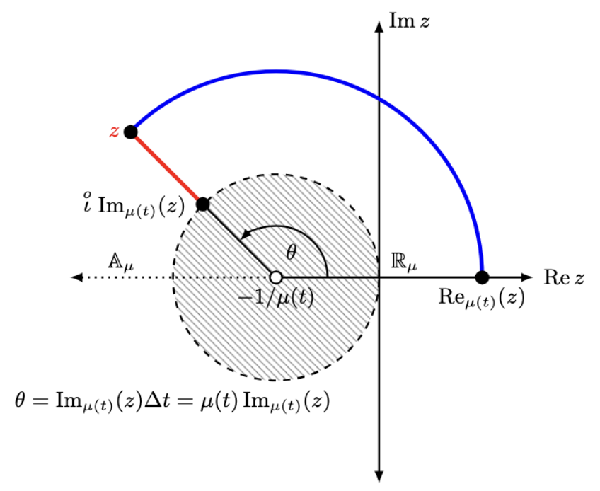
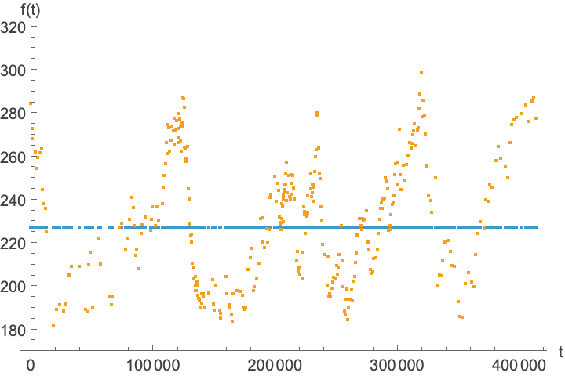
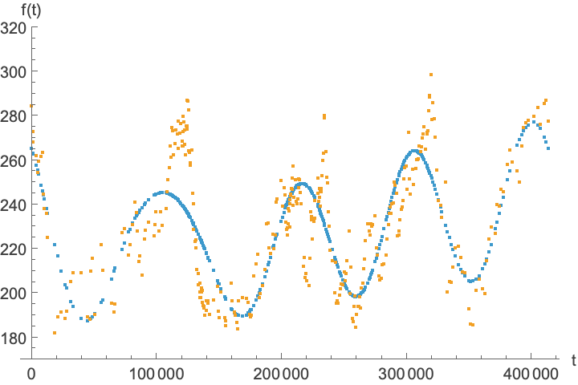
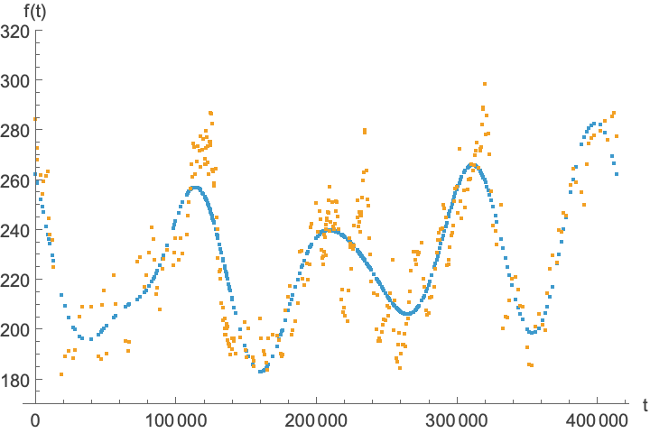

$$
    \newcommand{\R}{\mathbb{R}}
    \newcommand{\N}{\mathbb{N}}
    \newcommand{\C}{\mathbb{C}}
    \newcommand{\T}{\mathbb{T}}
    \newcommand{\Z}{\mathbb{Z}}
    \newcommand{\icirc}{\overset{\odot}{\imath}}
    \newcommand{\xibar}{\overline{\xi}}
    \newcommand{\xibarinv}{\overline{\xi}^{-1}}
$$

# Fourier Series on Discrete Periodic Time Scales

Dylan Poulsen
Washington College

---

### Outline

* Hilger's Complex Plane
* Ergodic Complex Plane
* Review Fourier Series
* Fourier Series on $\T$
* Antarctic Ice Core Example

---

### Hilger's Local Plane

* Local behavior of $e_{z}(t,t_0)$ at time $t \in \T$ in terms of $z \in \C \setminus \{-1/\mu(t)\} = \C_{\mu(t)}$.

* Central to Hilger's plane is the *cylinder transformation* $\xi_{\mu(t)}: \C_{\mu(t)} \rightarrow \Z_{\mu(t)}$ defined by $\displaystyle \xi_{\mu(t)}(z) = \frac{\text{Log}(1+\mu(t) z)}{\mu(t)},$
where $\Z_{\mu(t)} := \left\{z \in \C \mid -\frac{\pi}{\mu(t)} < \text{Im}(z) \leq \frac{\pi}{\mu(t)} \right\}.$

---

### Hilger's Local Plane

$$
\begin{align*}
\hspace{0.5in} \text{Re}_{\mu(t)}(z) &:= \frac{|1+z \mu(t)|-1}{\mu(t)}  \\
                      &= \xi_{\mu(t)}^{-1}(\text{Re}(\xi_{\mu(t)}(z))) 
\end{align*}
$$

---

### Hilger's Local Plane

$$
\begin{align*}
\hspace{0.5in} \text{Re}_{\mu(t)}(z) &:= \frac{|1+z \mu(t)|-1}{\mu(t)} \\
                      &= \xi_{\mu(t)}^{-1}(\text{Re}(\xi_{\mu(t)}(z))) \\
\hspace{0.5in} \text{Im}_{\mu(t)}(z) &:= \frac{\text{Arg}(1+z \mu(t))}{\mu(t)} \\
                      & = \text{Im}(\xi_{\mu(t)}(z)) \\
\end{align*}
$$

---

### Hilger's Local Plane

$$
\begin{align*}
\hspace{0.5in} \text{Re}_{\mu(t)}(z) & := \frac{|1+z \mu(t)|-1}{\mu(t)} \\
                      &= \xi_{\mu(t)}^{-1}(\text{Re}(\xi_{\mu(t)}(z))) \\
\hspace{0.5in} \text{Im}_{\mu(t)}(z) & := \frac{\text{Arg}(1+z \mu(t))}{\mu(t)} \\
                      & = \text{Im}(\xi_{\mu(t)}(z)) \\
\stackrel{o}{\iota} \text{Im}_{\mu(t)}(z) & := \frac{e^{i \text{Im}_{\mu(t)}(z) \mu(t)}-1}{\mu(t)} \\
                      & = \xi^{-1}_{\mu(t)}( i \text{Im}(\xi_{\mu(t)}(z)))
\end{align*}
$$

---

### Hilger's Local Plane

* With $a \oplus_{\mu(t)} b := a + b + \mu(t) a b$, Hilger's local plane is isomorphic to the cylinder strip $\Z_{\mu(t)}$ with addition mod $2 \pi i/\mu(t)$.

* $z \oplus_{\mu(t)} w = \xi_{\mu(t)}^{-1}(\xi_{\mu(t)}(z) + \xi_{\mu(t)}(w))$

* Hilger's decomposition: $z = \text{Re}_{\mu(t)}(z) \oplus_{\mu(t)} \stackrel{o}{\iota} \text{Im}_{\mu(t)}(z)$

---

### Ergodic Global Plane

* Global behavior of $e_{z}(t,t_0)$ in terms of $z \in \C \setminus \{-1/\mu(t) \mid t \in \T\} := \C_{\mu(\T)}$.

* On a periodic (or finite) time scale of length $L$, defined by the *average* of the cylinder transformation $\displaystyle \xibar(z) = \frac{1}{L} \int_{0}^{L} \xi_{\mu(\tau)}(z) \Delta \tau$ (at least off the branch cut).

---

### Ergodic Global Plane

* The generalization of the cylinder strip is the set $\C^{\Omega} = \{z \in \C \mid -\Omega < \text{Im}(z) \leq \Omega\}$, where $\Omega$ is the Nyquist frequency.

* We have carefully defined $\xibar: \C_{\mu(\T)} \rightarrow \C^{\Omega}$ on the branch cut and shown that the resulting map is globally univalent. 

* $z \boxplus_{\T} w = \xibar^{-1}(\xibar(z) + \xibar(w) (\text{mod} 2 i \Omega))$

---

### Ergodic Global Plane

$$
\begin{align*}
\hspace{0.2in}\text{Re}_{\T}(z) &= \xibar^{-1}(\text{Re}(\xibar(z))) \hspace{1in}
\end{align*}
$$

---

### Ergodic Global Plane

$$
\begin{align*}
\hspace{0.2in}\text{Re}_{\T}(z) &= \xibar^{-1}(\text{Re}(\xibar(z))) \hspace{1in}\\
\text{Im}_{\T}(z) & = \text{Im}(\xibar(z))
\end{align*}
$$

---

### Ergodic Global Plane

$$
\begin{align*}
\hspace{0.2in}\text{Re}_{\T}(z) &= \xibar^{-1}(\text{Re}(\xibar(z))) \hspace{1in}\\
\text{Im}_{\T}(z) & = \text{Im}(\xibar(z)) \\
\icirc \text{Im}_{\T}(z) & := \xibar^{-1}( i \text{Im}(\xibar(z))) 
\end{align*}
$$

---

### Ergodic Global Plane

$$
\begin{align*}
\hspace{0.2in}\text{Re}_{\T}(z) &= \xibar^{-1}(\text{Re}(\xibar(z))) \hspace{1in} \\
\text{Im}_{\T}(z) & = \text{Im}(\xibar(z)) \\
\icirc \text{Im}_{\T}(z) & := \xibar^{-1}( i \text{Im}(\xibar(z))) \\ 
z & = \text{Re}_{\T}(z) \boxplus_{\T} \icirc \text{Im}_{\T}(z)
\end{align*}
$$

---

### Fourier Series on $\R$

On $\R$, the Fourier series for an $L$-periodic function $f:\R \rightarrow \C$ is given by 
$$ 
\begin{align*}
f(t) & = \sum_{n=-\infty}^{\infty} c_n e^{i \frac{2 \pi n}{L} t} \\
     & = \sum_{n=-\infty}^{\infty} c_n e_{\xi_{0}^{-1}\left(i \frac{2 \pi n}{L}\right)}(t,0), \text{ with} \\
c_n  & = \frac{1}{L} \int_{0}^{L} f(t) e^{-i \frac{2\pi n}{L} t} \; dt.
\end{align*}
$$
---

### Fourier Series on $\Z$

On $\Z$, the discrete Fourier series for an $L$-periodic function $f: \Z \rightarrow \C$ is given by
$$ 
\begin{align*}
f(t) & = \sum_{n=-\lfloor (L-1)/2 \rfloor}^{\lceil (L-1)/2 \rceil} c_n e^{i \frac{2\pi n}{L} t} \\
     & = \sum_{n=-\lfloor (L-1)/2 \rfloor}^{\lceil (L-1)/2 \rceil} c_n e_{\xi_{1}^{-1}\left(i \frac{2 \pi n}{L} \right)}(t,0), \text{ with} \\
c_n  & = \frac{1}{L} \sum_{t=0}^{L-1} f(t) e^{-i \frac{2\pi n}{L} t}.
\end{align*}
$$
---

### Fourier Series on $\T$

**Key Insight**: Basis functions should be exponentials with zero growth rate and a harmonic frequency. That is, they should be time scale exponentials with subscript
$$
\xibarinv\left( i \omega_n \right) = \icirc \omega_n,
$$
where $\omega_n$ is a harmonic frequency.

---

### Fourier Series on $\T$

* To calculate the values of the subscripts, we could sample the Nyquist interval uniformly and numerically calculate $\xibarinv$ at each of these sample points. There is an easier way, however - eigenvalues! 

* Let $\T = \{t_0,t_1,t_2,\ldots, t_{m-1}, t_m, t_1+L,t_2+L,\ldots t_0 + 2L, t_1+2L,\ldots\}$ be a periodic time scale of length $L$.

* We can write the dynamic equation on $\T$, $x^{\Delta} = \lambda x$, with a periodic condition $x(t_0) = x(t_m)$ as a system of equations.

---

### Fourier Series on $\T$

$$
\begin{align*}
\frac{x(t_{k+1}) - x(t_{k})}{\mu(t_k)} & = \lambda x(t_k) \qquad 0 \leq k \leq m-2 \\
\frac{x(t_m)-x(t_{m-1})}{\mu(t_{m-1})} & = \lambda x(t_{m-1})
\end{align*}
$$

---

### Fourier Series on $\T$

$$
\begin{align*}
\frac{x(t_{k+1}) - x(t_{k})}{\mu(t_k)} & = \lambda x(t_k) \qquad 0 \leq k \leq m-2 \\
\frac{x(t_0)-x(t_{m-1})}{\mu(t_{m-1})} & = \lambda x(t_{m-1})
\end{align*}
$$

---

### Fourier Series on $\T$

$$
\small
\begin{align*}
\begin{pmatrix}
-1/\mu(t_{0}) & 1/\mu(t_{0}) & 0 & \cdots & 0 & 0 \\
0 & -1/\mu(t_{1}) & 1/\mu(t_{1}) & \cdots & 0 & 0 \\
0 & 0 & -1/\mu(t_{2}) & {\scriptstyle \ddots} & 0 & 0 \\
\vdots & \vdots & {\scriptstyle \ddots} & {\scriptstyle \ddots} & 1/\mu(t_{m-3}) & 0 \\
0 & 0 & \cdots & 0 & -1/\mu(t_{m-2}) & 1/\mu(t_{m-2}) \\
1/\mu(t_{m-1}) & 0 & \cdots & 0 & 0 & -1/\mu(t_{m-1}) \end{pmatrix} \begin{pmatrix} x(t_0) \\ x(t_1) \\ x(t_2) \\ \vdots \\ x(t_{m-2}) \\ x(t_{m-1}) \end{pmatrix} = \lambda \begin{pmatrix} x(t_0) \\ x(t_1) \\ x(t_2) \\ \vdots \\ x(t_{m-2}) \\ x(t_{m-1}) \end{pmatrix}
\end{align*}
$$

The eigenvalues are $\icirc \omega_k, 0 \leq k \leq m-1$. 

The associated eigenvectors are $e_{\icirc \omega_k}(t,0)$ evaluated at each point in one period of the time scale.

---

### Fourier Series on $\T$

Now, we calculate the Fourier coefficients in 
$$
f(t) = \sum_{n=0}^{m-1} c_n e_{\icirc \omega_n}(t,0).
$$

---

### Theorem

Suppose $\T$ is a periodic time scale with $t_0=0$. Suppose also that $\icirc \omega_n$ exists for each $n, 0 \leq n \leq m-1,$ and are distinct. Then, the sets $\{e_{\icirc \omega_n}(t,0)\}$ and $\left\{e_{\ominus \icirc \omega_n}(\sigma(t),0)\right\}$ form a biorthogonal system, that is
$$
\int_0^L e_{\icirc \omega_n}(t,0) e_{\ominus \icirc \omega_l}(\sigma(t),0) \Delta t = K_{n} \delta_{n,l}.
$$

---

### Fourier Series on $\T$

Therefore,
$$
c_n=\frac{\int_{0}^{L} f(t) \cdot e_{\ominus \icirc \omega_n}(\sigma(t),0) \, \Delta t}{\int_{0}^{L} e_{\icirc \omega_n}(t,0) \cdot e_{\ominus \icirc \omega_n}(\sigma(t),0)\, \Delta t}.
$$

---

### Antarctic Ice Core Data

* Record of 400,000+ years of atmospheric CO2 concentration

* Irregularly sampled in time because the ice core is sampled uniformly along the length of the ice core.

---

### Spectrum

---

### Spectrum

---

### Bases

---

### Bases

---

### Bases

---

### Bases

---

### Approx

---

### Approx

---

### Approx

---

### Approx

---

### Approx

---

### Approx

---

### Approx

---

### Approx

---

### Questions?

Thank you for your attention. What questions do you have?